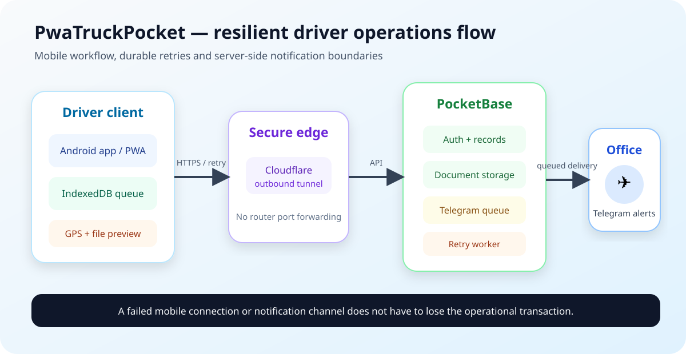

# PwaTruckPocket

**Offline-first driver operations app for trip status, geolocated documents and resilient mobile workflows.**

PwaTruckPocket was built around a real logistics problem: drivers need to communicate operational milestones and send travel documents from the road, often with unstable mobile coverage and without exposing office credentials or infrastructure details.

The project now has two delivery surfaces:

- an installable browser PWA;
- a native Android shell, verified from the stable internal APK `v1.0.1`, which adds Android share-target integration, native PDF handling, downloads and in-app update checks.

> Portfolio focus: process automation, mobile-first UX, offline recovery, secure integration boundaries and operational reliability.

## Why this project matters

A basic upload form would work only when the network is reliable. This project instead treats connectivity loss, repeated submissions, large mobile photos and document hand-off as normal operating conditions.

The result is a compact internal tool that connects the driver and office workflows:

```text
Driver action
   -> local validation and optional GPS capture
   -> immediate upload or durable local queue
   -> PocketBase record and file storage
   -> server-side Telegram queue
   -> office notification and operational follow-up
```

## Stable release — Android v1.0.1

The stable APK supplied for this portfolio review was inspected directly. Its package metadata identifies:

| Item | Value |
|---|---|
| Package | `biz.netfleet.autisti` |
| Version name | `1.0.1` |
| Version code | `2` |
| App shell | Android WebView + embedded local web assets |
| Main activity | `biz.netfleet.autisti.MainActivity` |

The binary is not committed because the deployed build contains private operational configuration and is distributed internally. The public repository documents the architecture and exposes configuration only through placeholders.

## What the current version demonstrates

### Driver workflow

- authenticated driver access through PocketBase;
- predefined trip-status updates;
- optional geolocation capture with a cached fallback;
- image or PDF document submission;
- notes attached to document records;
- personal submission history;
- Italian and Arabic interface, including RTL layout.

### Resilience on unstable mobile networks

- IndexedDB queue for pending status and document submissions;
- automatic synchronization when connectivity returns;
- visible online/offline and queue indicators;
- explicit manual synchronization;
- retries with timeout, exponential backoff and jitter;
- client-generated request IDs to support deduplication;
- image resizing and JPEG compression before upload.

### Native Android integration

- Android share target for images and PDFs;
- hand-off of incoming shared files to the embedded app;
- native PDF preview generation;
- opening local and remote documents through Android;
- download handling;
- geolocation permission bridge;
- in-app update discovery and APK installation flow;
- embedded local app shell for predictable startup.

### Server-side notifications

PocketBase hooks do not expose Telegram credentials to the browser. After a status or document is stored, the hook creates a queue record. A scheduled worker processes a bounded batch, sends the notification and retries failures up to a fixed limit.

This separates the operational transaction from the notification channel: a temporary Telegram error does not need to invalidate the driver's submission.

## Architecture



```text
Android app / browser PWA
        |
        | HTTPS through Cloudflare Tunnel
        v
PocketBase
  |- users
  |- stati_viaggio
  |- fogli_viaggio
  `- telegram_queue
        |
        | server-side hook + scheduled retry worker
        v
Telegram operations chat
```

See [`docs/architecture.md`](docs/architecture.md) for component boundaries, online/offline flows and native Android responsibilities.

## Reliability decisions

| Problem | Design choice |
|---|---|
| Intermittent connectivity | Store pending requests in IndexedDB and replay later |
| Duplicate retries | Stable client-side IDs and an optional unique backend field |
| Large mobile photos | Resize and recompress before queuing or uploading |
| Telegram outage | Durable server-side queue with attempts and terminal error state |
| GPS unavailable | Time-bounded lookup with last-known-position fallback |
| Sensitive credentials | Environment variables and server-side hooks only |
| Android document hand-off | Share target and native bridge instead of browser-only workflows |
| App startup dependency | Embedded local shell with API calls kept remote |

## Repository map

```text
pwatruckpocket/
|- index.html                 # PWA UI and workflow logic
|- config.example.js         # public runtime configuration template
|- manifest.json             # installable PWA metadata
|- sw.js                     # app-shell cache; API requests are excluded
|- pb_hooks/
|  `- telegram.pb.js         # notification queue producer and worker
|- cloudflared/
|- docs/
|  |- architecture.md
|  |- architecture.svg
|  |- android-release.md
|  |- deployment.md
|  |- pocketbase-schema.md
|  |- runbook.md
|  |- security.md
|  `- troubleshooting.md
|- docker-compose.yml
`- .env.example
```

## Run the public PWA stack

```bash
git clone https://github.com/Student13Thirteen/pwatruckpocket.git
cd pwatruckpocket
cp .env.example .env
cp config.example.js config.js
```

Set the public PocketBase URL in `config.js`, configure the environment placeholders in `.env`, then start the services:

```bash
docker compose up -d
docker compose ps
```

The native Android source and signed operational APK are not part of this public repository. [`docs/android-release.md`](docs/android-release.md) describes the verified native behavior and the public/private boundary.

## PocketBase collections

```text
users
stati_viaggio
fogli_viaggio
telegram_queue
```

The deployment may also use a unique `client_id` field on status and document collections so replayed offline requests remain idempotent. See [`docs/pocketbase-schema.md`](docs/pocketbase-schema.md).

## Security boundary

The frontend must never contain:

- PocketBase administrator credentials;
- Telegram bot token or private chat identifiers;
- Cloudflare tunnel token;
- production records, uploaded documents or backups;
- the private update manifest or production API origin.

The APK inspected for this review contains production-specific endpoints. For that reason it is evidence of a stable internal release, not a public distributable artifact. See [`docs/security.md`](docs/security.md).

## What I can explain and defend

This repository is intended to show more than a list of tools. I can walk through:

- why a two-stage client/server queue is useful;
- how queued files are reconstructed and retried;
- why API traffic is excluded from the service-worker cache;
- how secrets remain outside browser code;
- how the Android bridge receives shared documents and handles PDFs;
- how to diagnose a failed submission from the browser, PocketBase and Telegram worker logs;
- the trade-off between a simple internal tool and a larger fleet platform.

## Scope and limitations

This is a vertical internal operations tool, not a generic fleet-management SaaS. The public repository does not claim:

- broad device-farm testing;
- audited end-to-end encryption beyond standard HTTPS and platform storage;
- a public Play Store release;
- complete Android source availability;
- automatic proof that every generated or integrated component was authored without assistance.

The contribution represented here is the workflow design, deployment, configuration, integration, testing, troubleshooting and iterative verification of the system.

## Documentation

| Document | Purpose |
|---|---|
| [`docs/architecture.md`](docs/architecture.md) | browser, backend, native shell and queue boundaries |
| [`docs/android-release.md`](docs/android-release.md) | evidence and capabilities of the stable APK |
| [`docs/deployment.md`](docs/deployment.md) | deployment checklist |
| [`docs/pocketbase-schema.md`](docs/pocketbase-schema.md) | collections, fields and rules |
| [`docs/runbook.md`](docs/runbook.md) | operational checks and commands |
| [`docs/troubleshooting.md`](docs/troubleshooting.md) | common failures and recovery |
| [`docs/security.md`](docs/security.md) | sensitive-data boundary and hardening |

## Related projects

- [NFRP](https://github.com/Student13Thirteen) — broader operations and document-processing work, currently being prepared as a sanitised portfolio edition;
- [DockNextFlare](https://github.com/Student13Thirteen/docknextflare) — self-hosted private cloud architecture;
- [UptimeMonitoring](https://github.com/Student13Thirteen/uptimemonitoring) — service monitoring and Telegram alerting.

## License

MIT for the files published in this repository. The internal Android binary and production configuration are excluded.